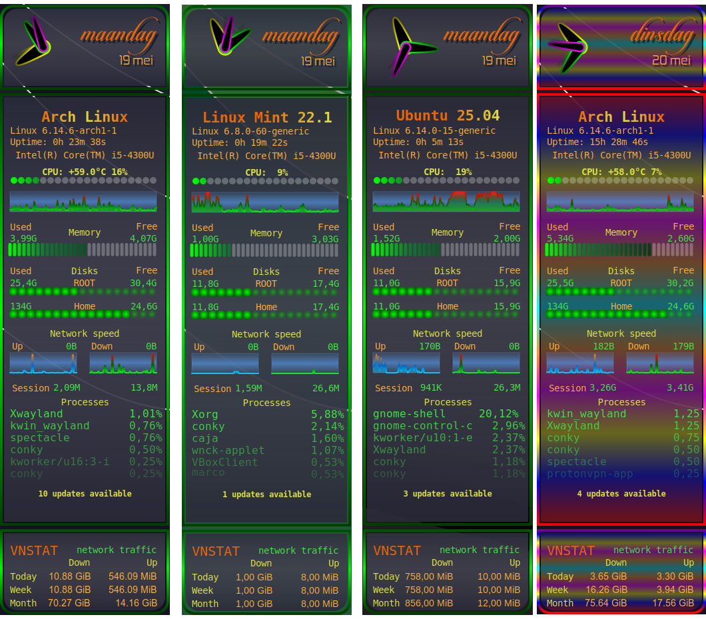

# conky-system-lua-V4

## Description

A collection of Conky configurations for system monitoring using Lua scripts. These Conkies offer visually appealing and customizable widgets to monitor system performance, networking, and more.

Conky is a lightweight system monitor that displays information on your desktop. With Lua, you can create beautiful, dynamic, and functional Conky widgets.

## Features

* System performance monitoring (CPU, RAM, Disk usage)
* Network statistics (via vnstat)
* Customizable visual themes using Lua scripts
* Easy setup and autostart script

## Requirements

To use these Conkies, ensure the following dependencies are installed:

* **Conky** (with Lua and Cairo enabled)
* **lm-sensors**: For temperature monitoring
* **vnstat**: For network statistics
* **bc** and **jq**: For command-line calculations and JSON parsing
* **Fonts**:
	+ [Candlescript](https://www.dafont.com/candlescript.font)
	+ [Zekton](https://www.dafont.com/zekton.font)
	+ DejaVu fonts (installable via your package manager)
* **Qt Libraries (Qt 5)**:  
	The **ConkySettingsUpdater** application is a Qt-based program. To run it, the following Qt libraries must be installed:

	+ **Debian/Ubuntu/Linux Mint and derivatives:**
		```sh
		sudo apt install libqt5widgets5 libqt5gui5 libqt5core5a
		```
	+ **Arch Linux and derivatives:**
		```sh
		sudo pacman -S qt5-base
		```

## Installation

1. Clone the repository:

	```sh
	git clone https://github.com/wim66/conky-system-lua-V4.git
	```

2. Install the required fonts:
	* Download and install Candlescript and Zekton from the links provided.
	* Install DejaVu fonts via your package manager:

		+ **Debian/Ubuntu/Linux Mint:**
			```sh
			sudo apt install fonts-dejavu
			```
		+ **Arch Linux:**
			```sh
			sudo pacman -S ttf-dejavu
			```

3. Install dependencies:

	* **Debian/Ubuntu/Linux Mint:**
		```sh
		sudo apt install conky-all lm-sensors vnstat bc jq
		```
	* **Arch Linux:**
		```sh
		sudo pacman -S conky lm_sensors vnstat bc jq
		```

4. Install Qt libraries (required for ConkySettingsUpdater):

	* **Debian/Ubuntu/Linux Mint:**
		```sh
		sudo apt install libqt5widgets5 libqt5gui5 libqt5core5a
		```
	* **Arch Linux:**
		```sh
		sudo pacman -S qt5-base
		```

5. Run `lm-sensors` configuration:

	```sh
	sudo sensors-detect
	```

6. **Make scripts executable**:  
	Ensure that **ConkySettingsUpdater** and all Bash scripts are executable. Run the following commands in the main folder:

	```sh
	chmod +x ConkySettingsUpdater
	chmod +x autostart-All.sh
	chmod +x conky-system-lua-V4/autostart.sh
	chmod +x conky-system-lua-V4/scripts/get_bitcoin_price.sh
	chmod +x conky-clock-lua-V1/autostart.sh
	chmod +x conky-vnstat-lua/autostart.sh
	chmod +x conky-vnstat-lua/scripts/vnstat.sh
	```

## Usage

1. Edit the `settings.lua` files located inside the Conky folders using **ConkySettingsUpdater** to customize your setup. For more information on using ConkySettingsUpdater, please refer to the application's documentation.
   
2. Start the Conkies using the provided autostart script:

	```sh
	./autostart-All.sh
	```

## Troubleshooting

* **Fonts not displaying correctly**: Ensure the required fonts are installed and available in your system.
* **Missing data in widgets**: Verify that `lm-sensors` and `vnstat` are configured correctly.
* **Qt errors when running ConkySettingsUpdater**: Make sure the appropriate Qt libraries (Qt 5) are installed for your distribution.

## Known Issues

* None reported yet. If you encounter any issues, please report them on the [issue tracker](https://github.com/wim66/conky-system-lua-V4/issues).

## License

This project is licensed under the MIT License. See the [LICENSE](https://github.com/wim66/conky-system-lua-V4/blob/main/LICENSE) file for details.

## Author

Created by [Wim66](https://github.com/wim66).

## Preview

